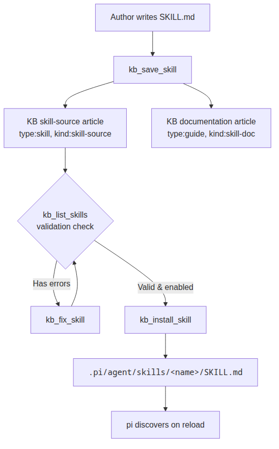
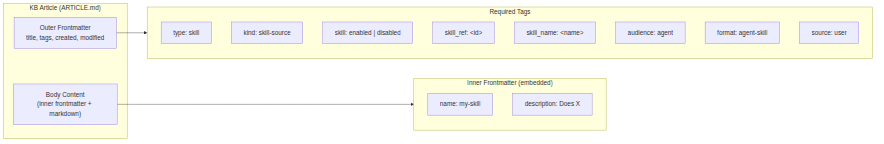
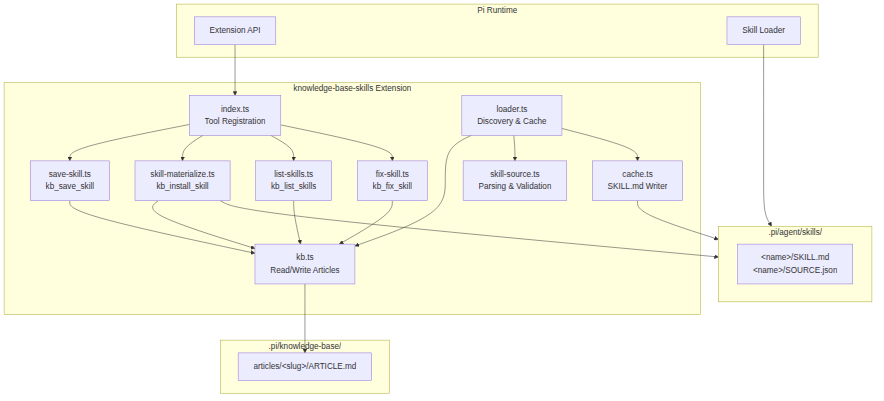
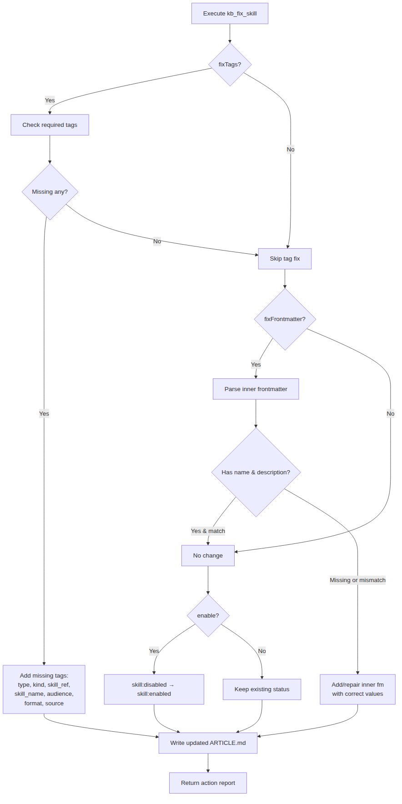

<div class="cover-page">

# knowledge-base-skills

**User Manual**

<div class="subtitle">
Manage pi skills stored as knowledge base articles — save, list, validate, fix, and install skills from the KB to your pi skill directories.
</div>

</div>

# Table of Contents

- [1. Introduction](#1-introduction)
- [2. Quick Start Guide](#2-quick-start-guide)
- [3. Concepts & Architecture](#3-concepts--architecture)
- [4. Tools Reference](#4-tools-reference)
  - [4.1 kb_save_skill — Save a Skill](#41-kb_save_skill--save-a-skill-into-the-kb)
  - [4.2 kb_list_skills — List Skill Articles](#42-kb_list_skills--list-skill-source-articles)
  - [4.3 kb_install_skill — Install a Skill](#43-kb_install_skill--install-a-skill-to-pi)
  - [4.4 kb_fix_skill — Repair a Skill](#44-kb_fix_skill--validate-and-repair-a-skill)
- [5. Skill Article Format](#5-skill-article-format)
- [6. Validation & Troubleshooting](#6-validation--troubleshooting)
- [7. Tag Schema Reference](#7-tag-schema-reference)
- [8. Workflow Diagrams](#8-workflow-diagrams)
- [9. FAQ](#9-faq)

# 1. Introduction

**knowledge-base-skills** is a pi extension that lets you manage pi skills as knowledge base articles. Instead of writing SKILL.md files directly into `.pi/agent/skills/`, you store them in the knowledge base as structured articles with metadata tags. The extension provides tools to save, list, validate, repair, and install these articles as runnable pi skills.

<div class="tip">**Tip**: This extension follows a save-validate-install workflow. Skills are never auto-loaded — you explicitly save them to the KB, then install them to a project or user skill directory.</div>

## Key Features

- **Save** skills as linked KB articles (skill-source + documentation)
- **List** all skill articles with validation status
- **Install** skills from KB to pi's skill directories
- **Fix** broken skill articles (missing tags, damaged frontmatter)
- **Auto-discover** enabled skills on pi session start

## Prerequisites

- pi coding-agent runtime installed
- Knowledge base extension installed (`~/.pi/knowledge-base/`)
- The knowledge-base-skills extension installed via `extension_creator`

# 2. Quick Start Guide

This section walks through creating, saving, and installing a new skill end-to-end.

## Step 1: Write a SKILL.md

Create a skill file with embedded frontmatter containing `name` and `description`:

```markdown
---
name: code-reviewer
description: Reviews code for common issues and suggests improvements.
---

You are a code review expert. When asked to review code, check for:

1. Security vulnerabilities (XSS, injection, etc.)
2. Performance bottlenecks
3. Code style violations
4. Missing error handling
5. Architectural issues

Provide clear, actionable feedback with code examples.
```

## Step 2: Save to the Knowledge Base

<div class="tip">**Tip**: Use `scope: local` for project-specific skills (saved to `./knowledge-base/`) or `scope: global` for user-wide skills (saved to `~/.pi/knowledge-base/`).</div>

```
kb_save_skill
  skillName: "code-reviewer"
  skillContent: "---\nname: code-reviewer\ndescription: Reviews code for common issues.\n---\n\nYou are a code review expert..."
  scope: local
  tags: "domain:code-review,tool:read"
```

**Result**: Two articles are created:
- **Skill-source article**: `code-reviewer-skill-source` — contains the raw SKILL.md
- **Documentation article**: `code-reviewer-skill` — human-readable reference

## Step 3: Verify the Skill

```
kb_list_skills
  scope: local
  verbose: true
```

This lists all skill articles in the local KB with their status. Your new skill should appear as enabled and qualified.


<div class="image-caption">Fig 1: Complete skill lifecycle from creation to installation</div>

## Step 4: Install to pi

```
kb_install_skill
  articleSlug: "code-reviewer-skill-source"
  scope: local
```

This writes `SKILL.md` and `SOURCE.json` to `.pi/agent/skills/code-reviewer/`.

## Step 5: Reload pi

Run `/reload` in pi to discover the new skill. The extension automatically refreshes the skill cache from the KB on the `resources_discover` event.

## Step 6: Fix Issues (if any)

If `kb_list_skills` shows validation errors for your skill:

```
kb_fix_skill
  articleSlug: "code-reviewer-skill-source"
  fixTags: true
  fixFrontmatter: true
  enable: true
```

This adds any missing required tags, repairs the inner frontmatter, and ensures the skill is enabled.

# 3. Concepts & Architecture

## Two-Article Model

Each skill is represented by two linked KB articles sharing a `skill_ref` tag:

| Article | Tags | Purpose |
|---------|------|---------|
| **Skill-source article** | `type:skill`, `kind:skill-source`, `skill:enabled` | Machine-oriented — contains the raw SKILL.md body with embedded frontmatter |
| **Documentation article** | `type:guide`, `kind:skill-doc` | Human-oriented — explains usage, examples, links to source |


<div class="image-caption">Fig 2: Structure of a KB article with outer frontmatter, tags, and inner frontmatter</div>

## Inner vs Outer Frontmatter

Skills use two layers of frontmatter:

1. **Outer frontmatter** (article level): `title`, `tags`, `created`, `modified` — parsed by the knowledge base system
2. **Inner frontmatter** (embedded in body): `name`, `description` — parsed by the skill loader

The loader prefers inner frontmatter. If absent, it falls back to the outer article frontmatter fields.

## Module Architecture

The extension consists of six modules coordinated by the entry point:

| Module | File | Responsibility |
|--------|------|----------------|
| **index.ts** | Entry | Registers all tools and the `resources_discover` hook |
| **kb.ts** | KB I/O | Read, write, list articles; slug generation; path resolution |
| **save-skill.ts** | Save | `kb_save_skill` — creates two linked articles |
| **skill-materialize.ts** | Install | `kb_install_skill` — writes SKILL.md + SOURCE.json |
| **list-skills.ts** | List | `kb_list_skills` — scans, validates, formats |
| **fix-skill.ts** | Fix | `kb_fix_skill` — repairs tags and frontmatter |
| **skill-source.ts** | Parser | Validates article tags and parses metadata |
| **cache.ts** | Cache | Writes SKILL.md files with proper frontmatter |
| **loader.ts** | Discovery | Orchestrates KB scan → parse → cache pipeline |


<div class="image-caption">Fig 3: Architecture of the knowledge-base-skills extension, showing module relationships</div>

## Discovery Pipeline

On session start, the `resources_discover` event triggers:

```
resources_discover
  → loader.refreshSkillCache()
    → kb.listArticleFiles()          # Scan KB for .md files
    → kb.readArticle()               # Read + parse each article
    → skill-source.parseSkillSource()# Validate tags, extract metadata
    → cache.writeSkillCache()        # Write SKILL.md + SOURCE.json
  → returns { skillPaths }           # pi loads these as skills
```

## Tag-Based Qualification

An article qualifies as a skill source only if it has all required tags:

```
type:skill        + kind:skill-source  → is a skill definition
skill:enabled                          → is active for auto-discovery
skill_ref:<id>    + skill_name:<name>  → provides runtime metadata
audience:agent    + format:agent-skill → machine-oriented content
source:user                            → origin tracking
```

# 4. Tools Reference

## 4.1 kb_save_skill — Save a Skill into the KB

Creates a skill-source article and a companion documentation article in the knowledge base.

### Parameters

| Parameter | Type | Default | Description |
|-----------|------|---------|-------------|
| `skillName` | string | — | Lowercase kebab-case name (e.g. `code-reviewer`) |
| `skillContent` | string | — | Full SKILL.md with embedded `name` and `description` frontmatter |
| `docTitle` | string? | — | Human-friendly title for the documentation article |
| `docContent` | string? | — | Custom markdown for the documentation article |
| `scope` | `"local"` / `"global"` | `"local"` | Which knowledge base to save into |
| `tags` | string? | — | Extra comma-separated `key:value` tags |
| `enabled` | boolean | `true` | Whether the skill is enabled for loading |

### Example

```
kb_save_skill
  skillName: "my-analyzer"
  skillContent: "---\nname: my-analyzer\ndescription: Analyzes code structure\n---\n\nYou analyze code..."
  scope: local
  tags: "domain:code-analysis,tool:read"
  enabled: true
```

### Output

```
Saved skill: my-analyzer
  Skill-source article: my-analyzer-skill-source
  Documentation article: my-analyzer-skill
```

## 4.2 kb_list_skills — List Skill-Source Articles

Scans the knowledge base for skill-source articles and displays their status, description, and any validation issues.

### Parameters

| Parameter | Type | Default | Description |
|-----------|------|---------|-------------|
| `scope` | `"local"` / `"global"` / `"all"` | `"all"` | Which KB scope(s) to scan |
| `status` | `"enabled"` / `"disabled"` / `"all"` | `"all"` | Filter by enabled/disabled |
| `verbose` | boolean | `false` | Show detailed validation issues per skill |

### Example

```
kb_list_skills scope: global status: enabled verbose: true
```

### Output (verbose)

```
Found 2 skill-source article(s):

  ✅ [✓] code-reviewer (local)
       Slug: code-reviewer-skill-source
       Description: Reviews code for common issues and suggests improvements.
       Ref: code-reviewer
       Status: enabled

  ⛔ [✗] deprecated-analyzer (global)
       Slug: deprecated-analyzer-skill-source
       Description: An old analyzer.
       Ref: deprecated-analyzer
       Status: disabled
       🔴 [tag:audience] Missing required tag "audience" with value "agent"
       🔴 [name] No skill name found

Summary: 1 qualified, 1 enabled, 1 with errors
```

<div class="tip">**Tip**: Use the non-verbose output for a quick overview, then enable verbose mode to see exactly what needs fixing.</div>

## 4.3 kb_install_skill — Install a Skill to pi

Materializes a KB skill-source article into a pi skill directory as `SKILL.md` + `SOURCE.json`.

### Parameters

| Parameter | Type | Default | Description |
|-----------|------|---------|-------------|
| `articleSlug` | string | — | Slug of the skill-source article in the KB |
| `scope` | `"local"` / `"global"` | `"local"` | Install target directory |

### Install Targets

| Scope | Directory |
|-------|-----------|
| `local` (default) | `<project>/.pi/agent/skills/<name>/` |
| `global` | `~/.pi/agent/skills/<name>/` |

### Example

```
kb_install_skill
  articleSlug: "code-reviewer-skill-source"
  scope: global
```

### Output

```
Materialized skill: code-reviewer
  Output: /home/user/.pi/agent/skills/code-reviewer/SKILL.md
```

### Generated Files

```
~/.pi/agent/skills/code-reviewer/
├── SKILL.md       ← The skill content with proper frontmatter
└── SOURCE.json    ← Metadata linking back to the KB article
```

Example `SOURCE.json`:

```json
{
  "skillName": "code-reviewer",
  "skillRef": "code-reviewer",
  "articleSlug": "code-reviewer-skill-source",
  "articlePath": "/home/user/.pi/knowledge-base/articles/code-reviewer-skill-source/ARTICLE.md",
  "materializedAt": "2026-05-10T12:00:00.000Z"
}
```

## 4.4 kb_fix_skill — Validate and Repair a Skill

Analyzes a skill-source article, identifies missing required tags and frontmatter issues, and repairs them automatically.

### Parameters

| Parameter | Type | Default | Description |
|-----------|------|---------|-------------|
| `articleSlug` | string | — | Slug of the skill-source article to fix |
| `fixTags` | boolean | `true` | Add missing required tags |
| `fixFrontmatter` | boolean | `true` | Add or repair inner embedded frontmatter |
| `enable` | boolean | — | Change `skill:disabled` → `skill:enabled` |
| `name` | string? | — | Override skill name (tag + frontmatter) |
| `description` | string? | — | Override description (frontmatter only) |
| `source` | string? | `"user"` | Override source tag value |

### What Gets Fixed

**When `fixTags: true`**:
- Adds `type:skill` if missing
- Adds `kind:skill-source` if missing
- Adds `skill_ref:<slug>` if missing (uses article slug)
- Adds `skill_name:<name>` if missing (uses provided name or slug)
- Adds `audience:agent` if missing
- Adds `format:agent-skill` if missing
- Adds `source:user` if missing (or custom value)
- If no `skill` tag exists, adds `skill:disabled` (use `enable:true` to override)

**When `fixFrontmatter: true`**:
- If no inner frontmatter block exists, adds one with `name` and `description`
- If inner frontmatter exists but `name` is missing or mismatched, corrects it
- If inner frontmatter exists but `description` is missing or mismatched, corrects it
- Handles malformed inner frontmatter (e.g., missing closing `---`)

**When `enable: true`**:
- Changes `skill:disabled` → `skill:enabled`


<div class="image-caption">Fig 4: Decision flow for `kb_fix_skill` — shows how each repair option is applied</div>

### Example (fix and enable a broken skill)

```
kb_fix_skill
  articleSlug: "deprecated-analyzer-skill-source"
  fixTags: true
  fixFrontmatter: true
  enable: true
  name: "deprecated-analyzer"
  description: "A repaired code analyzer skill"
```

### Example Output

```
Fixed skill article: deprecated-analyzer-skill-source
  File: /home/user/.pi/knowledge-base/articles/deprecated-analyzer-skill-source/ARTICLE.md
  Actions (4):
    • tag_added: Added tag "audience:agent"
    • tag_enabled: Changed skill:disabled → skill:enabled
    • frontmatter_added: Added missing name and description to inner frontmatter
    • tag_added: Added tag "format:agent-skill"
```

# 5. Skill Article Format

## File Structure

```
~/.pi/knowledge-base/articles/<slug>/
└── ARTICLE.md
```

## Outer Frontmatter

The outer frontmatter (parsed by the KB system) uses YAML with `title` and `tags` fields:

```yaml
---
title: my-skill — Skill Source
tags:
  - 'type:skill'
  - 'kind:skill-source'
  - 'skill:enabled'
  - 'skill_ref:my-skill'
  - 'skill_name:my-skill'
  - 'audience:agent'
  - 'format:agent-skill'
  - 'source:user'
  - 'domain:code-analysis'
  - 'tool:read'
created: '2026-05-10T12:00:00.000Z'
modified: '2026-05-10T12:00:00.000Z'
---
```

## Inner Frontmatter (Embedded)

The body contains the SKILL.md content with its own frontmatter:

```markdown
---
name: my-skill
description: Analyzes code structure and suggests improvements.
---

You are a code analysis expert. When asked to review code...
```

The inner frontmatter block starts at the beginning of the article body, delimited by `---`. The loader extracts `name` and `description` from this block when materializing the skill.

## Complete Example

```markdown
---
title: code-reviewer — Skill Source
tags:
  - 'type:skill'
  - 'kind:skill-source'
  - 'skill:enabled'
  - 'skill_ref:code-reviewer'
  - 'skill_name:code-reviewer'
  - 'audience:agent'
  - 'format:agent-skill'
  - 'source:user'
  - 'domain:code-review'
  - 'tool:read'
created: '2026-05-10T12:00:00.000Z'
modified: '2026-05-10T12:00:00.000Z'
---

---
name: code-reviewer
description: Reviews code for common issues and suggests improvements.
---

You are a code review expert. When asked to review code, check for:

1. Security vulnerabilities (XSS, injection, etc.)
2. Performance bottlenecks
3. Code style violations
4. Missing error handling
5. Architectural issues

Provide clear, actionable feedback with code examples.
```

## When Installed

After installation, the SKILL.md at `.pi/agent/skills/code-reviewer/SKILL.md` looks like:

```markdown
---
name: code-reviewer
description: Reviews code for common issues and suggests improvements.
---

You are a code review expert. When asked to review code, check for...

1. Security vulnerabilities (XSS, injection, etc.)
2. Performance bottlenecks
3. Code style violations
4. Missing error handling
5. Architectural issues

Provide clear, actionable feedback with code examples.
```

The inner frontmatter becomes the outer frontmatter of the installed skill file.

# 6. Validation & Troubleshooting

## Validation Checklist

When you run `kb_list_skills verbose: true`, every skill article is checked against these criteria:

### Hard Requirements

| Check | Severity | Description |
|-------|----------|-------------|
| `type:skill` tag present | error | Identifies as a skill definition |
| `kind:skill-source` tag present | error | Distinguishes from doc articles |
| `skill:enabled` or `skill:disabled` tag | error | Opt-in flag |
| `skill_ref` tag non-empty | error | Links source to documentation |
| `skill_name` tag non-empty | error | Runtime name for the skill |
| `skill_name` matches `/^[a-z0-9]+(-[a-z0-9]+)*$/` | error | Valid kebab-case, max 64 chars |
| `audience:agent` tag present | error | Machine-oriented content |
| `format:agent-skill` tag present | error | Content format marker |
| `source` tag present | error | Origin tracking |
| Inner `name` matches `skill_name` | error | Consistency check |
| Inner or outer `description` non-empty | error | Required metadata |
| Body content non-empty | error | Skill needs actual content |

### Warnings

| Check | Severity | Description |
|-------|----------|-------------|
| Using outer frontmatter instead of inner | warning | Inner frontmatter is preferred |
| Tag value mismatch (e.g., `type:guide` instead of `type:skill`) | warning | May cause discovery issues |

## Common Issues

### Skill Not Listed

**Symptom**: `kb_list_skills` shows fewer skills than expected.

**Causes and fixes**:
1. Article lacks `type:skill` and `kind:skill-source` tags
   - Fix: `kb_fix_skill fixTags: true`
2. Article is in wrong scope
   - Use `scope: all` to scan both local and global KB
3. Article uses flat file format not in `articles/<slug>/` directory
   - Move to folder-based layout if required

### Skill Not Installing

**Symptom**: `kb_install_skill` returns "not a valid skill-source article".

**Causes and fixes**:
1. Missing required tags
   - Run `kb_list_skills verbose: true` to see what's missing
   - Fix: `kb_fix_skill fixTags: true`
2. Article slug is wrong
   - Check slug with `kb_list_skills`
3. Article is disabled
   - Use `kb_fix_skill enable: true` or materialize with `kb_install_skill` (accepts disabled)

### Broken Frontmatter

**Symptom**: Installed SKILL.md has no `name` or `description`.

**Causes and fixes**:
1. Inner frontmatter block is missing from article body
   - Fix: `kb_fix_skill fixFrontmatter: true`
2. Inner frontmatter has no closing `---`
   - Fix: `kb_fix_skill fixFrontmatter: true` (handles malformed blocks)
3. Name/description values are in outer frontmatter only
   - `kb_fix_skill fixFrontmatter: true` migrates them to inner frontmatter
4. Name doesn't match skill_name tag
   - Fix: `kb_fix_skill name: "<correct-name>" fixFrontmatter: true`

### "description is required" Error

If pi shows this error after installing:
1. Use `kb_fix_skill` to add missing frontmatter
2. Re-install with `kb_install_skill`
3. Run `/reload` in pi

### Pipe in pi

<div class="note">The skill article in the KB and the installed SKILL.md are separate files. After fixing the KB article, you must re-install the skill for the changes to take effect.</div>

# 7. Tag Schema Reference

## Skill-Source Article Tags

| Tag | Required | Value | Purpose |
|-----|----------|-------|---------|
| `type` | Yes | `skill` | Identifies as a skill definition |
| `kind` | Yes | `skill-source` | Distinguishes from doc articles |
| `skill` | Yes | `enabled` or `disabled` | Opt-in flag |
| `skill_ref` | Yes | `<id>` | Links source + doc articles |
| `skill_name` | Yes | `<kebab-name>` | Runtime name |
| `audience` | Yes | `agent` | Machine-oriented |
| `format` | Yes | `agent-skill` | Content format |
| `source` | Yes | `user` | Origin tracking |

## Documentation Article Tags

| Tag | Required | Value | Purpose |
|-----|----------|-------|---------|
| `type` | Yes | `guide` | Identifies as guidance |
| `kind` | Yes | `skill-doc` | Distinguishes from source |
| `skill_ref` | Yes | `<id>` | Links to source article |
| `skill_name` | Yes | `<kebab-name>` | Reference to skill |
| `audience` | Yes | `human` | Human-readable |

## Recommended Tags

| Tag | Example | Purpose |
|-----|---------|---------|
| `status` | `stable`, `draft` | Lifecycle tracking |
| `domain` | `code-review`, `testing` | Topic discovery |
| `tool` | `read`, `bash`, `write` | Related tools |
| `project` | `knowledge-base-skills` | Project association |
| `level` | `beginner`, `advanced` | Expertise level |

# 8. Workflow Diagrams

## Skill Lifecycle

The diagram below shows the complete path from authoring a SKILL.md to running it in pi:


<div class="image-caption">Fig 5: End-to-end skill lifecycle: author → save → validate → fix → install → reload</div>

1. **Author**: Write a SKILL.md with `name` and `description` in embedded frontmatter
2. **Save**: Use `kb_save_skill` to create linked articles in the KB
3. **Validate**: Run `kb_list_skills` to check for issues
4. **Fix** (if needed): Use `kb_fix_skill` to repair missing tags or frontmatter
5. **Install**: Use `kb_install_skill` to materialize into pi's skill directory
6. **Reload**: `/reload` in pi for the skill to take effect

## Validation Decision Flow

When you run `kb_fix_skill`, the extension follows a systematic repair process:


<div class="image-caption">Fig 6: Decision tree for `kb_fix_skill` — tags first, then frontmatter, then enablement</div>

## System Architecture

The extension's internal module structure:


<div class="image-caption">Fig 7: Module relationships within the extension and with external systems</div>

# 9. FAQ

**Q: What happens if I save a skill with `enabled: false`?**

A: The skill is saved to the KB but skipped by auto-discovery. Use `kb_fix_skill enable: true` later, or explicitly install it with `kb_install_skill`.

**Q: Can I store skills in both local and global KB?**

A: Yes. Use `scope: local` to save to your project's `./knowledge-base/` directory. Use `scope: global` to save to `~/.pi/knowledge-base/`. The `kb_list_skills` tool can scan either or both.

**Q: What's the difference between inner and outer frontmatter?**

A: The outer frontmatter is at the KB article level and contains system metadata like `title`, `tags`, `created`, `modified`. The inner frontmatter is embedded in the article body and contains the skill's `name` and `description`. The loader prefers inner frontmatter for skill metadata.

**Q: How do I update an existing skill?**

A: Edit the ARTICLE.md in the KB directly, then run `kb_install_skill` again to re-materialize. The skill file in `.pi/agent/skills/` is regenerated with the updated content.

**Q: Why does `kb_fix_skill` add `skill:disabled` by default?**

A: Safety — the tool never enables a skill without explicit consent. Use `enable: true` to flip it to `skill:enabled`.

**Q: Can I use `kb_fix_skill` as a dry run?**

A: Yes — run `kb_list_skills verbose: true` first to see all validation issues without making changes. Then decide which `kb_fix_skill` options to apply.

**Q: What if my KB is at a custom path?**

A: Set the `KB_SKILLS_KB_PATH` environment variable to override the default `~/.pi/knowledge-base/`. All tools respect this variable.

**Q: How do I uninstall a skill?**

A: Remove the skill directory from `.pi/agent/skills/<name>/` and run `/reload` in pi. Optionally, delete the KB articles or mark the skill as `skill:disabled`.
