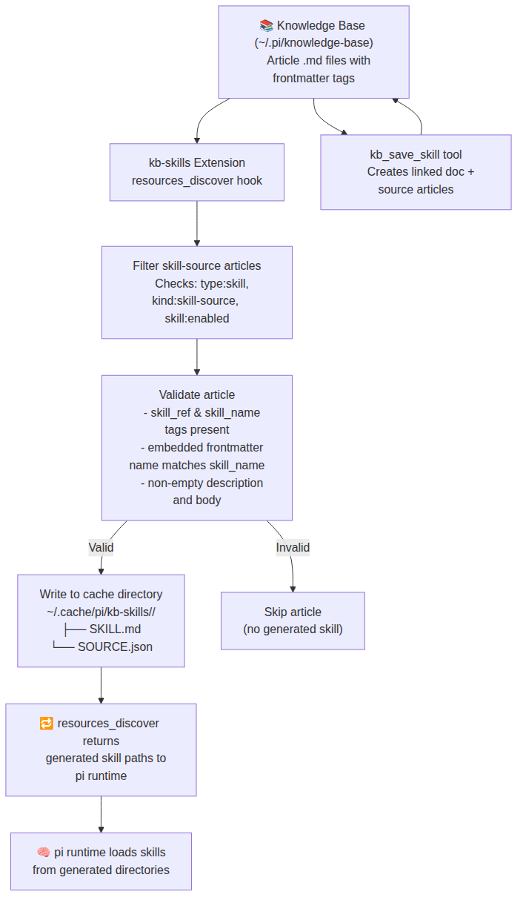
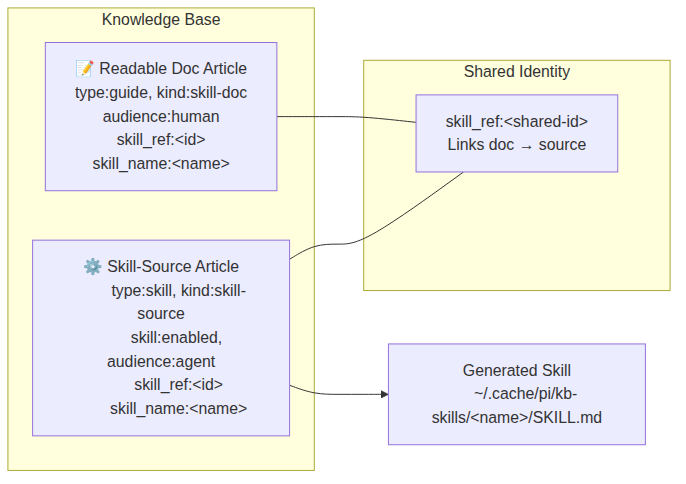
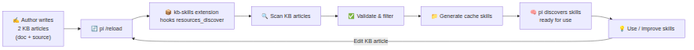
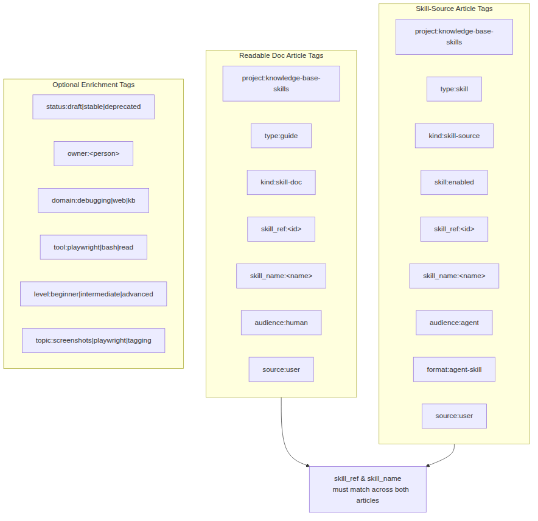

<div class="cover-page">

# knowledge-base-skills

**User Manual**

<div class="subtitle">
A pi extension that discovers, validates, and loads skills stored as knowledge-base articles.
</div>

<div class="version">
Version 1.0.0
</div>

<div class="date">
May 2026
</div>

</div>

# 1. Introduction

The **knowledge-base-skills** extension bridges two powerful pi concepts: the **knowledge base** (persistent, tagged articles) and **pi skills** (reusable, loadable instruction sets for the agent).

Instead of maintaining standalone `SKILL.md` files on disk, you can author skills as knowledge-base articles, tag them appropriately, and let this extension automatically discover, validate, and generate loadable skill directories at every pi reload.

## 1.1 What problem does it solve?

| Problem | Solution |
|---------|----------|
| Skills are scattered across the filesystem | Centralize them inside the knowledge base |
| No easy way to group skills by domain | Use tags (`domain:`, `topic:`) for rich discovery |
| Hard to document what a skill does | Dual-article model: one human-readable doc, one machine-readable skill source |
| Manually linking skill doc to skill file | Shared `skill_ref` identity ties them together |
| No validation before a skill loads | Built-in parser validates frontmatter, tags, and content before generating |

## 1.2 Key concepts

- **Skill-source article** — A KB article tagged with `type:skill`, `kind:skill-source`, `skill:enabled`. Contains valid skill markdown in its body.
- **Readable doc article** — A KB article tagged with `type:guide`, `kind:skill-doc`. Explains what the skill does, when to use it, and how it works.
- **Shared identity** — Both articles carry matching `skill_ref` and `skill_name` tags, creating a stable link between them.
- **Generated skill** — At every pi reload, the extension scans KB articles, extracts valid skill sources, and writes them into a cache directory as ready-to-load skills.

<div class="image-caption">Fig 1: System architecture — from KB articles to loaded pi skills</div>



# 2. Quick Start

This section walks you through creating your first knowledge-base-backed skill and making it available to pi.

## 2.1 Prerequisites

- pi coding agent installed and configured
- The `knowledge-base-skills` extension installed
- A knowledge base directory at `~/.pi/knowledge-base/` (or custom path via `KB_SKILLS_KB_PATH`)

## 2.2 Create a skill-source article

Create a file at `~/.pi/knowledge-base/my-first-skill-source.md`:

```markdown
---
title: My First Skill source
tags:
  - type:skill
  - kind:skill-source
  - skill:enabled
  - skill_ref:my-first-skill
  - skill_name:my-first-skill
  - status:draft
  - domain:general
---

---
name: my-first-skill
description: A simple demonstration skill that says hello.
---

Hello! This skill is loaded from the knowledge base.
```

<div class="tip">
**Tip**: The outer frontmatter is for KB metadata (tags, title). The inner frontmatter (second `---` block) is the skill frontmatter — it must include `name` and `description`. Both `name` fields must match `skill_name`.
</div>

## 2.3 Reload pi

Run the reload command in pi:

```
/reload
```

The extension hooks into `resources_discover`, scans the KB, validates the article, and generates a skill directory at `~/.cache/pi/kb-skills/my-first-skill/`.

## 2.4 Verify the skill is loaded

The generated files look like this:

```
~/.cache/pi/kb-skills/my-first-skill/
├── SKILL.md
└── SOURCE.json
```

`SOURCE.json` contains a manifest pointing back to the original KB article:

```json
{
  "skillName": "my-first-skill",
  "skillRef": "my-first-skill",
  "articleSlug": "my-first-skill-source",
  "articlePath": "/home/immac/.pi/knowledge-base/my-first-skill-source.md"
}
```

## 2.5 Create a companion doc article (recommended)

Create `~/.pi/knowledge-base/my-first-skill-doc.md`:

```markdown
---
title: My First Skill — Documentation
tags:
  - project:knowledge-base-skills
  - type:guide
  - kind:skill-doc
  - skill_ref:my-first-skill
  - skill_name:my-first-skill
  - audience:human
  - source:user
  - status:draft
  - domain:general
---

## Summary

This is a minimal demonstration skill created during the Quick Start guide.

## Purpose

Show the minimal structure required for a KB-backed skill.

## When to use

- As a template for creating new skills
- To verify the extension pipeline works end-to-end
```

Now both articles share `skill_ref:my-first-skill`, forming a linked pair visible in the KB graph.

<div class="image-caption">Fig 2: The dual-article model linking documentation and skill source via a shared skill_ref</div>



# 3. How It Works

The extension operates in a pipeline of four stages during every pi reload.

## 3.1 Discovery

When pi starts or reloads, it fires the `resources_discover` event. The extension's registered handler:

1. Locates the knowledge base directory
2. Lists all `.md` files (skipping `.sidecar.md` files)
3. Reads each article's frontmatter and content

## 3.2 Filtering

Each article is checked for three required tags:

| Tag | Value | Purpose |
|-----|-------|---------|
| `type` | `skill` | Identifies the article as a skill entity |
| `kind` | `skill-source` | Distinguishes from doc-only articles |
| `skill` | `enabled` | Opt-in flag; articles without this are skipped |

If any required tag is missing, the article is silently skipped.

## 3.3 Validation

Passing articles undergo deeper validation:

1. `skill_ref` tag must be present and non-empty
2. `skill_name` tag must be present and match `^[a-z0-9]+(-[a-z0-9]+)*$` (≤64 chars)
3. The article body is parsed for an inner frontmatter block
4. The inner `name` must match `skill_name` exactly
5. The inner `description` must be non-empty
6. The body after the inner frontmatter must be non-empty

Any failure causes the article to be skipped.

## 3.4 Generation

Valid skill sources are materialized into a cache directory:

```
<cache-root>/<skill-name>/
├── SKILL.md      # The raw skill markdown content
└── SOURCE.json   # Manifest with skill_name, skill_ref, article slug, and path
```

The cache directory is wiped and rebuilt on every reload, ensuring generated skills always reflect the current KB state.

## 3.5 Loading

The generated skill paths are returned from `resources_discover`, making pi's skill loader discover them as runtime skills — exactly as if they were hand-written `SKILL.md` directories.

<div class="image-caption">Fig 3: The complete lifecycle from authoring to loaded skill</div>



# 4. Article Model

Each skill in the knowledge base is represented by **two articles** sharing a common identity.

## 4.1 Readable Documentation Article

**Purpose**: Explain the skill to humans — what it does, when to use it, examples, caveats, and maintenance notes.

**Required tags**:

| Tag | Value |
|-----|-------|
| `project` | `knowledge-base-skills` |
| `type` | `guide` |
| `kind` | `skill-doc` |
| `audience` | `human` |
| `source` | `user` |
| `skill_ref` | `<shared-id>` |
| `skill_name` | `<name>` |

**Recommended content sections**:

- Summary
- Purpose
- When to use
- Examples
- Related tools / skills
- Pointer to skill-source article (by `skill_ref`)

## 4.2 Skill-Source Article

**Purpose**: Hold the canonical machine-oriented skill markdown that the extension transforms into a loadable `SKILL.md`.

**Required tags**:

| Tag | Value |
|-----|-------|
| `project` | `knowledge-base-skills` |
| `type` | `skill` |
| `kind` | `skill-source` |
| `skill` | `enabled` |
| `audience` | `agent` |
| `format` | `agent-skill` |
| `source` | `user` |
| `skill_ref` | `<shared-id>` |
| `skill_name` | `<name>` |

**Body requirement**: The article body must contain valid skill markdown with an inner frontmatter block:

```markdown
---
name: <skill-name-matching-tag>
description: <non-empty description>
---

... skill instructions, tools, guidelines ...
```

## 4.3 Shared Identity

The `skill_ref` tag is the glue. It allows:

- One doc article to point to one skill-source article
- Easy grouping via KB queries (`skill_ref:my-skill`)
- Future support for variants or alternate versions

The `skill_name` tag must match exactly between both articles, and must also match the inner frontmatter `name` in the skill-source article.

<div class="image-caption">Fig 4: Tag schema — required and optional tags for both article types</div>



# 5. Tag Schema

Tags serve a dual purpose: filtering for the extension logic, and creating meaningful graph connections in the knowledge base.

## 5.1 Required tags — skill-source article

| Tag | Value | Checked by extension? |
|-----|-------|-----------------------|
| `type` | `skill` | Yes |
| `kind` | `skill-source` | Yes |
| `skill` | `enabled` | Yes |
| `skill_ref` | `<id>` | Yes (must exist) |
| `skill_name` | `<name>` | Yes (must be valid) |
| `project` | `knowledge-base-skills` | No (soft requirement) |
| `audience` | `agent` | No |
| `format` | `agent-skill` | No |
| `source` | `user` | No |

## 5.2 Required tags — doc article

| Tag | Value | Checked by extension? |
|-----|-------|-----------------------|
| `type` | `guide` | No |
| `kind` | `skill-doc` | No |
| `skill_ref` | `<id>` | No |
| `skill_name` | `<name>` | No |
| `project` | `knowledge-base-skills` | No |
| `audience` | `human` | No |
| `source` | `user` | No |

## 5.3 Optional enrichment tags

These tags are encouraged for better discovery and graph relationships:

| Tag family | Examples |
|------------|----------|
| Lifecycle | `status:draft`, `status:stable`, `status:deprecated` |
| Ownership | `owner:<person-or-team>` |
| Domain | `domain:debugging`, `domain:web`, `domain:knowledge-base` |
| Tool | `tool:playwright`, `tool:bash`, `tool:read`, `tool:web-search` |
| Topic | `topic:screenshots`, `topic:playwright`, `topic:tagging` |
| Level | `level:beginner`, `level:intermediate`, `level:advanced` |
| Relationship | `rel:documentation`, `rel:runtime-source` |

## 5.4 Tag format

Tags use the `key:value` format in YAML frontmatter lists:

```yaml
tags:
  - type:skill
  - kind:skill-source
  - skill:enabled
```

The extension also accepts object-style tags:

```yaml
tags:
  type: skill
  kind: skill-source
```

# 6. Creating a Skill

This section describes the full workflow for authoring a new skill in the knowledge base.

## 6.1 Decide on a shared identity

Choose a unique, URL-friendly `skill_ref` and `skill_name`. They can be identical:

- `skill_ref:debug-with-screenshots`
- `skill_name:debug-with-screenshots`

The `skill_name` must match `^[a-z0-9]+(-[a-z0-9]+)*$` and be ≤64 characters.

## 6.2 Write the skill-source article

Create a new file in your KB directory. The filename should end with `-source.md` for clarity (e.g., `debug-with-screenshots-source.md`).

```markdown
---
title: Debug with Screenshots — Skill Source
tags:
  - type:skill
  - kind:skill-source
  - skill:enabled
  - skill_ref:debug-with-screenshots
  - skill_name:debug-with-screenshots
  - status:draft
  - domain:debugging
  - tool:playwright
---

---
name: debug-with-screenshots
description: Captures full-page screenshots of web pages using Playwright for visual debugging.
---

You are an expert in Playwright screenshot debugging.

When asked to debug a page visually:

1. Install Playwright if not present: `npx playwright install chromium`
2. Write a script that navigates to the page and captures a full-page screenshot
3. Save the screenshot and describe what you see
4. Highlight any visual anomalies

Use `chromium.launch({ headless: true })` and `page.screenshot({ fullPage: true })`.
```

<div class="warning">
**Important**: The inner frontmatter `name` must exactly match the `skill_name` tag. If they differ, the article is rejected.
</div>

## 6.3 Write the companion doc article

Create a second file (e.g., `debug-with-screenshots-doc.md`):

```markdown
---
title: Debug with Screenshots — Documentation
tags:
  - project:knowledge-base-skills
  - type:guide
  - kind:skill-doc
  - skill_ref:debug-with-screenshots
  - skill_name:debug-with-screenshots
  - audience:human
  - source:user
  - status:draft
  - domain:debugging
  - tool:playwright
---

## Summary

Captures full-page screenshots using Playwright to aid visual debugging of web pages.

## Purpose

When the agent needs to understand the visual state of a web page — layout issues, missing elements, styling problems — this skill automates screenshot capture and analysis.

## When to use

- Web page rendering looks incorrect
- Need visual confirmation of DOM changes
- Debugging responsive layout issues
- Verifying UI state after interactions

## Related

- Debug with Screenshots (skill source) — `skill_ref:debug-with-screenshots`
```

## 6.4 Reload and verify

```
/reload
```

Check the cache directory:

```bash
ls ~/.cache/pi/kb-skills/debug-with-screenshots/
# → SKILL.md  SOURCE.json
```

## 6.5 Iterate

Edit the KB article directly, then reload pi. The cache is rebuilt from scratch on every reload, so changes are reflected immediately.

# 7. Extension Architecture

## 7.1 Module overview

The extension is structured as a standard pi extension with several internal modules:

| Module | File | Responsibility |
|--------|------|----------------|
| Entrypoint | `index.ts` | Hooks `resources_discover`, calls loader |
| Loader | `loader.ts` | Orchestrates discovery → validation → generation pipeline |
| KB reader | `kb.ts` | Reads `.md` files from the KB directory, parses frontmatter |
| Skill parser | `skill-source.ts` | Validates tags, parses inner frontmatter, returns `SkillSourceRecord` or null |
| Cache writer | `cache.ts` | Wipes and rewrites the cache directory with generated skill folders |
| Types | `types.ts` | Shared TypeScript interfaces |

## 7.2 Data flow

```
resources_discover event
        │
        ▼
getKnowledgeBaseSkillsConfig()
  - reads env vars or defaults
  - returns { knowledgeBasePath, cacheRoot }
        │
        ▼
refreshSkillCache(config)
        │
        ├── discoverSkillSources(config)
        │       ├── listArticleFiles(kbPath)      ← kb.ts
        │       ├── readArticle(slug, kbPath)      ← kb.ts
        │       └── parseSkillSource(article)      ← skill-source.ts
        │
        ├── writeSkillCache(cacheRoot, sources)    ← cache.ts
        │       ├── rm -rf cacheRoot
        │       ├── mkdir -p cacheRoot/<skillName>/
        │       ├── write SKILL.md
        │       └── write SOURCE.json
        │
        └── returns string[] of generated paths
                │
                ▼
        resources_discover → { skillPaths }
```

## 7.3 Key interfaces

```typescript
interface KnowledgeBaseArticle {
  slug: string;
  title: string;
  content: string;
  tags: ValueTag[];
  filePath: string;
}

interface SkillSourceRecord {
  article: KnowledgeBaseArticle;
  skillName: string;
  skillDescription: string;
  skillContent: string;
}

interface KnowledgeBaseSkillsConfig {
  knowledgeBasePath: string;
  cacheRoot: string;
}
```

## 7.4 Extension registration

The extension is registered in `package.json`:

```json
{
  "pi": {
    "extensions": ["./knowledge-base-skills.ts"]
  }
}
```

The barrel file (`knowledge-base-skills.ts`) re-exports from `dist/index.js`, which calls `registerKnowledgeBaseSkills(pi)`.

# 8. Configuration

## 8.1 Environment variables

| Variable | Default | Purpose |
|----------|---------|---------|
| `KB_SKILLS_KB_PATH` | `~/.pi/knowledge-base` | Path to the knowledge base directory |
| `KB_SKILLS_CACHE_PATH` | `~/.cache/pi/kb-skills` | Path to the generated skill cache |

## 8.2 Override example

```bash
export KB_SKILLS_KB_PATH=/path/to/custom/kb
export KB_SKILLS_CACHE_PATH=/path/to/custom/cache
```

## 8.3 Cache directory

The cache directory is **completely rebuilt** on every pi reload. Any manual edits to files inside `<cache>/<skill-name>/` will be overwritten. Always edit the source KB article instead.

Cache structure:

```
<KB_SKILLS_CACHE_PATH>/
├── <skill-name-1>/
│   ├── SKILL.md
│   └── SOURCE.json
├── <skill-name-2>/
│   ├── SKILL.md
│   └── SOURCE.json
└── ...
```

# 9. Validation Rules

## 9.1 Hard requirements (reject if missing)

| Rule | Condition |
|------|-----------|
| Required tags | Article must have `type:skill`, `kind:skill-source`, `skill:enabled` |
| `skill_ref` | Must be present and non-empty |
| `skill_name` | Must match `^[a-z0-9]+(-[a-z0-9]+)*$`, ≤64 chars |
| Inner frontmatter `name` | Must match `skill_name` exactly |
| Inner frontmatter `description` | Must be non-empty |
| Body content | Must be non-empty after inner frontmatter |

## 9.2 Soft requirements (warnings only)

These are not enforced by the parser but are strongly recommended:

- Missing companion doc article (same `skill_ref`)
- Missing `project:knowledge-base-skills` tag
- Missing `status:*` tag
- Weak or overly vague description
- `skill_name` mismatch between article tags — if the tag says one thing but the embedded frontmatter says another, the article **is** rejected (this is a hard rule)

## 9.3 Validation summary table

| Check | Hard | Soft | What happens on failure |
|-------|------|------|-------------------------|
| `type:skill` | ✓ | | Article skipped |
| `kind:skill-source` | ✓ | | Article skipped |
| `skill:enabled` | ✓ | | Article skipped |
| `skill_ref` exists | ✓ | | Article skipped |
| `skill_name` valid | ✓ | | Article skipped |
| Inner frontmatter parses | ✓ | | Article skipped |
| Inner `name` matches `skill_name` | ✓ | | Article skipped |
| Inner `description` non-empty | ✓ | | Article skipped |
| Body non-empty | ✓ | | Article skipped |
| Companion doc exists | | ✓ | Warning (future) |
| `status:*` present | | ✓ | Logged |
| `project:*` present | | ✓ | Logged |

# 10. Tool Reference

## 10.1 Planned tools

The extension is designed with a **tool-first interface**. The following tools are planned for future release:

**kb_save_skill** (planned)

Creates or updates both a readable doc article and a skill-source article in the knowledge base, normalizing tags and establishing the shared identity.

| Parameter | Type | Required | Description |
|-----------|------|----------|-------------|
| `skillName` | string | Yes | Runtime skill name |
| `skillDescription` | string | Yes | Description for skill frontmatter |
| `skillContent` | string | Yes | Raw skill markdown body |
| `docTitle` | string | No | Title for the doc article |
| `docContent` | string | No | Content for the doc article |
| `sharedRef` | string | No | Auto-generated if absent |
| `tags` | string | No | Comma-separated `key:value` pairs |
| `status` | string | No | e.g. `draft`, `stable` |
| `enabled` | boolean | No | Whether `skill:enabled` is set |

**kb_list_skills** (planned)

Lists all skill-source articles currently in the KB.

**kb_export_skill** (planned)

Exports a generated skill back to a standalone `SKILL.md` file.

**kb_enable_skill** / **kb_disable_skill** (planned)

Toggle the `skill:enabled` tag on a skill-source article.

**kb_validate_skills** (planned)

Runs validation against all KB articles and reports issues.

# 11. Development

## 11.1 Project structure

```
knowledge-base-skills/
├── knowledge-base-skills.ts   # Barrel / entrypoint
├── package.json               # Dependencies and pi registration
├── tsconfig.json              # TypeScript config
├── src/
│   ├── index.ts               # Extension registration
│   ├── loader.ts              # Discovery → generation orchestration
│   ├── kb.ts                  # KB file reading and frontmatter parsing
│   ├── skill-source.ts        # Skill content validation and extraction
│   ├── cache.ts               # Cache directory management
│   └── types.ts               # Shared interfaces
├── dist/                      # Compiled output
├── test/
│   └── loader.test.mjs        # Integration test
└── tutorial/                  # This user manual
```

## 11.2 Build

```bash
npm run build
```

Compiles TypeScript from `src/` to `dist/`.

## 11.3 Test

```bash
npm test
```

Builds and runs the Node test suite. The test creates a temporary KB with one valid skill-source article and one non-skill article, verifies that only the valid one is discovered and cached, then cleans up.

## 11.4 Key design decisions

| Decision | Rationale |
|----------|-----------|
| Dual-article model | Separates human documentation from machine skill content |
| Cache rebuilt on every reload | No stale state; always reflects current KB |
| Hard validation rules | Prevents invalid skills from loading silently |
| Silent skip for non-skills | Non-skill articles are never logged as errors |
| `skill_ref` as linker | Simple, queryable, extensible to multi-article groups |

## 11.5 Future enhancements

- **Save-skill tool**: CLI for creating skill articles from within pi
- **Skill listing and search**: Query KB for skills by domain, status, tool
- **Disabled skill handling**: Generate but hide vs. omit entirely
- **Asset/reference support**: Copy referenced files into generated skill directories
- **Multi-variant skills**: One doc article for multiple skill-source variants

# 12. FAQ

**Q: My skill isn't loading after `/reload`. How do I debug?**

A: Check these common issues:
1. Are all three required tags present? (`type:skill`, `kind:skill-source`, `skill:enabled`)
2. Does `skill_name` match the inner frontmatter `name`?
3. Is `skill_name` in lowercase with hyphens (no spaces, no uppercase)?
4. Is there a non-empty `description` and body content?
5. Check the cache directory — if the skill folder didn't appear, validation failed.

**Q: Can I have multiple skill-source articles with the same `skill_ref`?**

A: Currently no. Each `skill_ref` + `skill_name` pair should be unique. Future versions may support variants.

**Q: What happens if I manually edit files in the cache?**

A: They will be overwritten on the next `/reload`. Always edit the KB article instead.

**Q: Can I use the same `skill_name` in two different skill-source articles?**

A: No — `skill_name` becomes the directory name. Duplicates would collide in the cache.

**Q: Does the extension support articles with no inner frontmatter?**

A: If the article body doesn't contain a valid inner frontmatter with `name` and `description`, it's rejected. The outer (KB) frontmatter alone is not sufficient.

**Q: How do I temporarily disable a skill without deleting it?**

A: Remove the `skill:enabled` tag (or change it to `skill:disabled`) and reload. The article will be skipped.

**Q: Can I store assets alongside the skill?**

A: Not yet. The current model generates only `SKILL.md` and `SOURCE.json`. Asset support is planned.

**Q: What's the difference between `skill_ref` and `skill_name`?**

A: `skill_ref` is a stable identifier for linking doc and source articles. `skill_name` is the runtime directory name that pi uses to load the skill. They are often identical but don't have to be.

**Q: Does the extension warn me about missing doc articles?**

A: Not yet. Soft validation warnings (missing companion doc, missing `status` tag) are planned for a future release.
